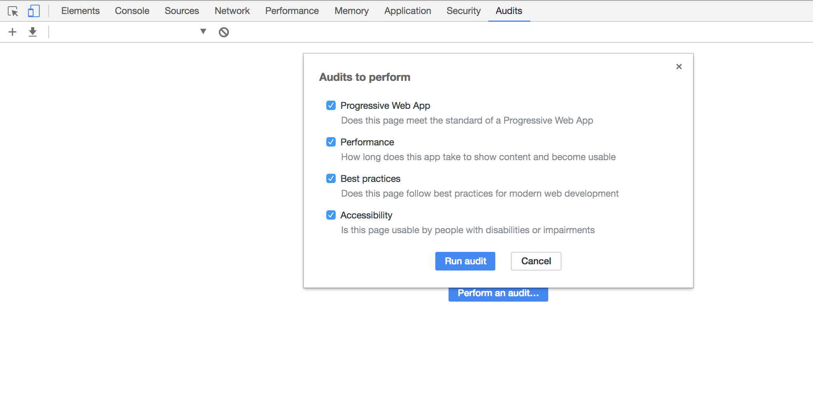

# 检查面板

##### 对当前网页进行网络利用情况、网页性能方面的诊断，并给出一些优化建议
> 选中Performance, Best Practices, Accessibility, and Progressive Web App，点击Run按钮，将会对当前页面进行网络利用率和页面的性能优化作出诊断，并给出相应的优化建议。 这个对于优化前端页面、加速网页加载速度很有用（相当于Yslow）

## HOW TO USE？
 
- Progressive Web App（在移动端利用提供的标准化框架，在网页应用中实现和原生应用相近的用户体验）: 检查网页是否符合PWA的标准。
- Performance:检查网页加载时间
- Best Practices : 检查页面是否遵循Google Web开发最佳实践
- Accessibility : 检查网页能否给残障人士使用