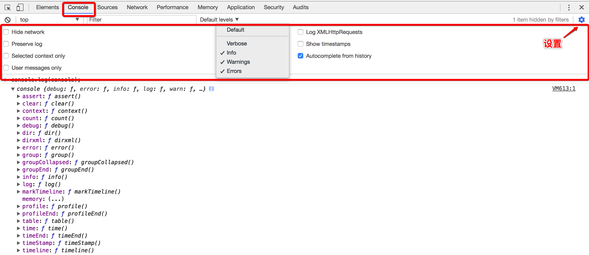

# 控制台面板

##### 在开发期间，可以使用控制台面板记录诊断信息，或者使用它作为shell在页面上与JavaScript交互

> console 中有很多对我们调试代码有帮助的函数，我们可以在开发环境中配合 console 来调试代码，使得我们测试更加便利。
> 注： 当需要换到下一行而不是回车的时候，请按Shift+Enter。

## HOW TO USE？
  

代码实例 | 用途
---|---
console.log("这是平凡的字符串");|打印字符串
console.info("这是温柔的提示");|打印提示消息
console.warn("这是严肃的警告");|打印警告消息
console.error("这是错误消息");|打印错误消息
console.debug("这是调试信息");|打印调试信息,console.log方法的别称
console.log(console);|打印对象
console.assert(1 == 0);|判断真假情况
console.group('报数');  console.log("一！");  console.log("二！");  console.groupEnd();|分组输出
console.groupCollapsed();|创建一个新的分组.随后输出到控制台上的内容都会被添加一个缩进,表示该内容属于当前分组,直到调用console.groupEnd() 之后,当前分组结束。
var data = [{'姓名': 'zlt', '数量': 1}];    console.table(data);|显示关联数组信息
console.dir(document.body);|将一个 JavaScript 对象的所有属性和属性值显示成一个可交互的列表,以树的结构进行输出
var test = document.getElementById('test');   console.dirxml(test);|查看页面中对应元素的 html/xml 内容
console.log('%cMy name is zlt.', 'color: #fff; background: #000; font-size: 24px;');|特殊的标示符%c，对输出的文字可以附加特殊的样式,background属性的url()中添加图片路径就可以实现图片的输出了 
$('table')	|返回与指定的CSS选择器相匹配的第一个元素，等同于document.querySelector();如果你使用的库，如jQuery使用$，那么这个功能将被覆盖，并且$将对应用该库的实现
$$('table')	|返回与指定的CSS选择器相匹配的所有元素的数组，等同于document.querySelectorAll()
$_	|引用最近的一个表达式,功能与按向上的方向键再回车一样
$0 ~ $4	|最近选择过的5个DOM节点。$0会返回最近一次点选的DOM结点。以此类推，$1返回的是上上次点选的DOM节点。最多可以保存5个，如果不满5个，则返回undefined。
$x('//*[@id="console"]/div[2]/table[2]/tbody/tr[4]')|返回与指定的XPath相匹配的所有元素的数组
var data = {name: 'zlt',num: 1};   keys(data);	|返回传入对象所有属性名组成的数据
var data = {name: 'zlt',num: 1};   values(data);	|返回所有属性值组成的数组
inspect(document.body)	|Elements面板跳到需要查看的对象上  
getEventListeners(document.getElementById  ("eventListeners")).click[0].listener|查看某个DOM对象上的事件  
monitorEvents(document.body, "click")	|监控相关的事件,unmonitorEvents便是用来停止这一监控
console.clear()	|清理函数
clear()	|用 chrome 的 command line api 来清理控制台
copy(document.body)	|在控制台获取到的内容复制到剪贴板
document.designMode = "on"	|直接修改网页内容
**monitor(function) 接收一个函数名作为参数，比如function a,每次a被执行了，都会在控制台输出一条信息，里面包含了函数的名称a及执行时所传入的参数。 而unmonitor(function)便是用来停止这一监听。**
```
function sayHello(name) {
  alert('hello,' + name);
}
monitor(sayHello);
sayHello('zlt');
unmonitor(sayHello);
sayHello('zlttt');
```
**调试一个方法，当该方法调用时会暂停并且在源码中定位，效果和断点类似。undebug可以停止调试。**
```
function sayHello(name) {
    alert('hello,' + name); 
}
debug(sayHello);
sayHello('zlt');
```

**记录次数**
```
function hi(name) {
  console.count(name);
  return "hi " + name;
}
for(var i = 0; i < 10; i++) {
  if(i < 4) {
    hi("person");
  } else {
    hi("zlt");
  }
}
```

**记录代码运行所花费的时间,评估某段代码或是某个函数的性能**
```
console.time("神机妙算");
  (function () {
    for(var i = 0; i < 10; i++) {
      var sum = (function () {
        var flog = 0;
        for(var i = 0; i < 10; i++) {
          flog+=i;
         }
      })();
    }
  })();
console.timeEnd("神机妙算");
```
**评估某段代码或是某个函数的性能,结果显示在 Memory面板的profile中**
 ```
console.profile("更高级的神机妙算");
(function () {
    for(var i = 0; i < 10; i++) {
      var sum = (function () {
        var flog = 0;
        for(var i = 0; i < 10; i++) {
          flog+=i;
        }
      })();
    }
})();
console.profileEnd("更高级的神机妙算");
```
**追踪函数的调用过程**
```
function add(num) {
  if (0 < num) {
    console.trace("现在num的值为", num);
    return num + add(num - 1);
  } else {
    return 0;
  }
}
var a =3;
add(3);
```
