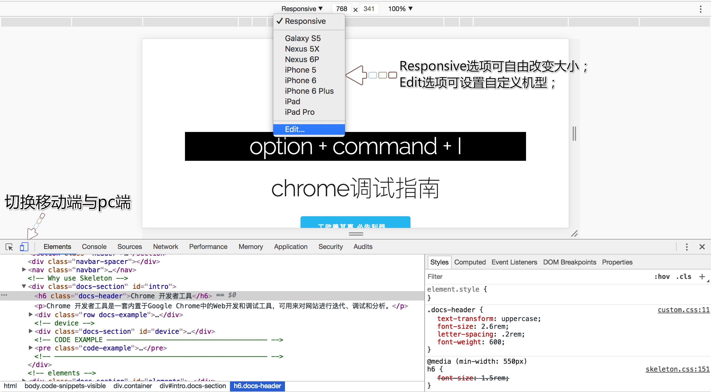

# 设备模式

##### 构建完全响应式，移动优先的网络体验  

> 点击它可以切换到不同的终端(移动端和pc端)进行开发模式。    
> 还可以选择不同的移动终端设备，同时可以选择不同的尺寸比例。  
> chrome浏览器的模拟移动设备和真实的设备相差不大，是非常好的选择。    

## HOW TO USE？
  

除了上图标出的功能，右上角可以发现移动端调试的更多功能哦!  

- Show device frame : 显示设备外壳
- Show media queries : 显示媒体查询(对屏幕大小的判断生成响应式布局)
- Show rulers : 显示标尺
- Add device pixel ratio : 调整设备的像素比例
- Add device type : 调整设备类型
- Capture screenshot : 捕捉当前屏幕截图
- Capture full size screenshot : 捕捉完整屏幕截图
- Reset to defaults : 恢复默认