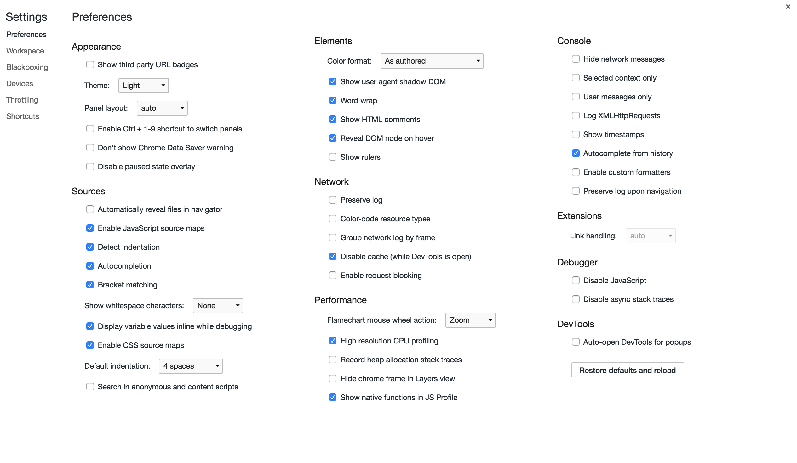

# 开发者工具主菜单

##### 自定义并控制DevTools，也叫开发者工具主菜单
> 单击DevTools窗口右上角的“┇”按钮即可打开主菜单。

## HOW TO USE？

- Dock side: 调整DevTools的位置
- Show console drawer: 打开console的抽屉式选项卡
- Search all files : 在所有文件中搜索
- Open file : 打开指定文件
- More tools: 在抽屉式选项卡中打开更多工具
    - Animations:动画检查器
    - Coverage:使用动态分析（Dynamic Analysis）法来收集代码运行时的覆盖率
    - JavaScript Profiler:查看JavaScript函数的执行性能
    - Layers:看到页面中的复合层。（查找页面原因的时候非常有用）
    - Legacy Audits:旧版检查面板,面板的优化建议参照的是雅虎前端工程师的十四条黄金建议。
        - Network Utillzation(网络利用率)、Web Page Performance(界面性能)
        - Audit Present State(针对目前网页状态分析)、Reload Page and Audit on load(重新加载网页进行分析)
    - Network conditions:设置网络节流
    - Quick source:打开Source的抽屉式选项卡
    - Remote devices:连接远程设备
    - Rendering: 渲染设置
    - Request blocking:拦截请求
    - Search:在所有资源中搜索
    - Sensors:仿真面板,模拟移动设备的传感器
- Shortcuts:查看快捷键
- Settings:打开设置面板

 
- Preferences :首选项
    - Appearance:外观设置
        - Show third party URL badges:显示第三方URL标记？？？
        - Theme:改变devtool主题(简洁白／炫酷黑)
        - Panel layout:改变面板布局(横版／竖版／自动)
        - Enable Ctrl + 1-9 shortcut to switch panels:用快捷键Ctrl + 1-9来切换面板
        - Don't show Chrome Data Saver warning:不显示chrome的节省数据流量警告
        - Disable paused state overlay: 禁用暂停悬浮框状态？？？
    - Sources:源代码面板设置
        - Automatically reveal files in navigator:在导航栏自动显示文件
        - Enable JavaScript source maps:在调试时如果有JS报错，浏览器就会通过解析map文件来重新merge压缩后的JS,使开发者可以用未压缩前的代码来调试。只有Chrome浏览器支持这个功能😲
        - Detect indentation:自动检测缩进
        - Autocompletion:自动补全
        - Bracket matching:括号自动匹配
        - Show whitespace characters:空白（空格、TAB、回车）显示设置
        - Display variable values inline while debugging:当前调试点及时预览 JavaScript 变量的内联值
        - Enable CSS source maps:在调试时如果有CSS报错，浏览器就会通过解析map文件来重新merge压缩后的CSS,使开发者可以用未压缩前的代码来调试。
        - Default indentation: 自定义默认缩进
        - Search in anonymous and content scripts:在匿名和内容脚本中搜索
    - Elements:元素面板设置
        - Color format:设置颜色格式
        - Show user agent shadow DOM:在元素标签器中显示被隐藏的组件代码
        - Word wrap:自动换行
        - Show HTML comments:显示HTML注释
        - Reveal DOM node on hover:在悬停状态下显示DOM节点
        - Show rulers: 鼠标悬停在某个元素上或者选中一个元素的时候会显示
    - Network:网络面板设置
        - Preserve log:保留请求日志
        - Color-code resource types: 不同色彩作标记资源类型
        - Group network log by frame:逐帧分组网络日志
        - Disable cache (while DevTools is open):禁用缓存
        - Enable request blocking:使请求阻塞
    - Performance:性能面板设置
        - Flamechart mouse wheel action:查看火焰图时鼠标滚轮的作用(缩放/滚动)
        - High resolution CPU profiling: 提高记录分析数据的准确性，能够以十分之一毫秒的度量来查看火焰图的数据
        - Record heap allocation stack traces:使用 Allocation 视图查看内存分配
        - Hide chrome frame in Layers view:Layers视图中隐藏谷歌浏览器内嵌框架(通过Internet Explorer的用户界面，以Chrome内核的渲染方式浏览网页)
        - Show native functions in JS Profile:使用 profiler 查看原生函数的执行性能
    - Console:控制台面板设置
        - Hide network messages:默认情况下，控制台将报告网络问题。启用此设置将指示控制台不显示这些错误的日志。例如，将不会记录 404 和 500 系列错误。
        - Selected context only:仅显示当前上下文的信息(top iframe worker extension)
        - User messages only: 仅显示console API方法的信息
        - Log XMLHttpRequests:确定控制台是否记录每一个 XMLHttpRequest。
        - Show timestamps:在调用时向显示的每条控制台消息追加一个时间戳。对于发生特定事件时的调试非常实用。这会停用消息堆叠。
        - Autocomplete from history:历史记录提示
        - Enable custom formatters:控制 JavaScript 对象的格式设置。
        - Preserve log upon navigation:在页面刷新或导航时保留控制台历史记录。
    - Extensions:扩展
        - Link handling:链接处理
    - Debugger:断点设置
        - Disable JavaScript:禁用JavaScript
        - Disable async stack traces:禁用异步堆栈跟踪
    - DevTools
        - Auto-open DevTools for popups:当新的标签/新窗口打开时,自动打开浏览器开发工具
- Workspace :把本地服务器的资源映射为硬盘上的文件，实现调试 JS 和 CSS 的同时自动保存文件
- Blackbox:屏蔽JS文件
    - 库代码（被屏蔽的文件）里抛出异常时不会暂停（当设置为Pause on exceptions时）
    - 调试时Stepping into/out/over都会忽略库代码
    - 事件断点也会忽略库代码
    - 库代码里设置的任何断点也不会起作用
    - 最终的结果就是只会调试应用代码而忽略第三方代码（配置了Blackbox的代码）。
- Emulated Devices:管理模拟设备
- Throttling:设置网络延迟与带宽
- Shortcuts:查看快捷键