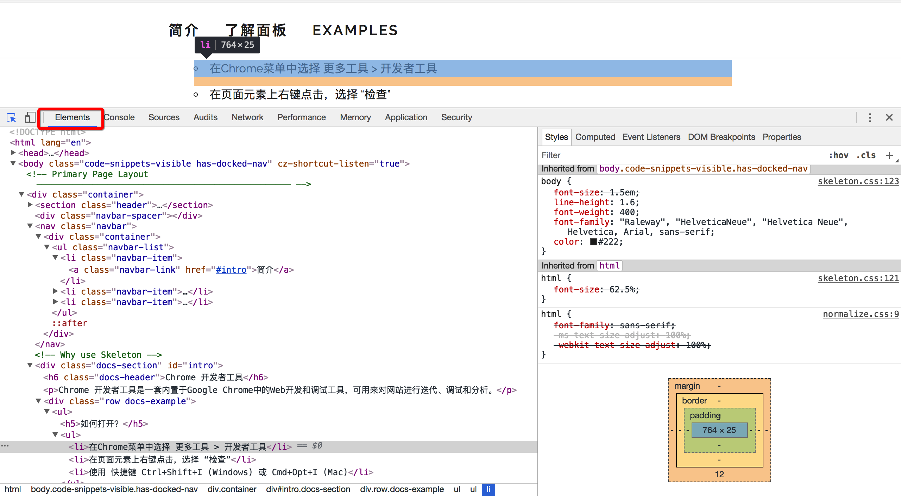
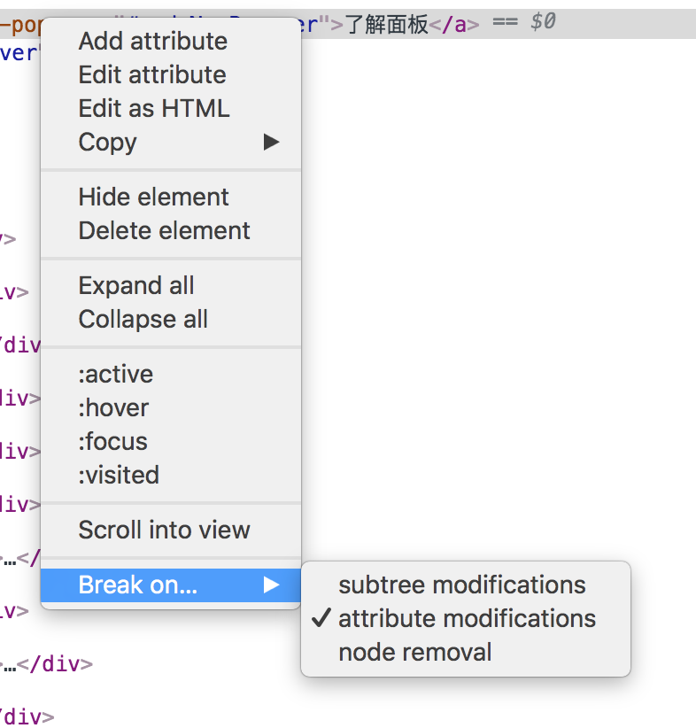

# 元素面板

**使用元素面板可以自由的操作DOM和CSS来迭代布局和设计页面**

> 该面板可以用来查看、修改页面上的元素，包括DOM标签以及css样式的查看、修改(ctrl + z 可撤销修改)，还可以展示相关盒模型的图形信息。    

## HOW TO USE？
  

```
🚩Tips：在 HTML DOM （文档对象模型）中，每个部分都是节点：  
1、文档本身是文档节点  
2、所有 HTML 元素是元素节点  
3、所有 HTML 属性是属性节点  
4、HTML 元素内的文本是文本节点（包括回车符也是属于文本节点）  
5、注释是注释节点  
Element 对象可以拥有类型为元素节点、文本节点、注释节点的子节点；  
元素也可以拥有属性，属性是属性节点。  
✔️总结：元素是元素节点，是节点中的一种，但元素节点中可以包含很多的节点。  
```


点击箭头按钮可选择元素,激活后，Elements窗口会根据在页面中鼠标的位置自动移动到相应的代码段并显示相关信息。  

### 区域①：Html的DOM树结构，可以进行查看定位编辑；
- 页面自动标出鼠标悬浮所在代码片段元素
- 点击DOM树视图里面的节点，区域2显示相关信息
- 直接在某个节点上双击即可修改，且能实时在浏览器里面得到反馈。
- 拖拽节点可以直接调整顺序，也可以拖拽节点到编辑器
- 浏览器对例如Video、Password等组件进行了封装，无法查看到组件的详细代码，不利于调试。Settings → Preferences → Elements → 勾选Show user agent shadow DOM,这样能够在元素标签器中显示被隐藏的组件代码
### 区域②：编辑修改并实时显示当前选中元素的CSS样式、属性等。
- Styles标签页: 显示用户定义的样式，还有开发者工具添加的样式；
    - 顶部"Filter"输入框 : 快速查找样式
    - 顶部":hov"按钮 : 可强制改变元素状态,:active(当元素被鼠标按下还没有松开，处于激活状态时所显示的状态),:hover(鼠标悬停时显示的状态),:focus(元素获得光标焦点时的状态),:visited(元素被点击后显示的状态)
    - 顶部".cls"按钮 : 快速修改元素class
    - 顶部"+"按钮 : 快速添加class
    - 单击即可修改样式
    - 在每个属性后面单击可以添加新的样式
    - 灰色的element.style同样可以进行添加和书写，唯一区别是在这里添加的样式是添加到了该元素内部，即style属性
    - 点击样式区域颜色前面的小方块可调出自定义调色板,支持在rgba、hsl和hexadecimal来回切换颜色模式和实时编辑预览页面颜色。
    - 每行右下角的"┇"可以快速添加阴影、字体颜色、背景颜色
- Computed标签页: 显示开发者工具计算好的元素样式（盒式模型）；
    - 双击数字即可修改
- Event Listeners标签页: 显示当前DOM节点和其祖先节点的所有JavaScript事件监听器,即查看元素上绑定了哪些事件；
    - 勾选Ancestors可显示其祖先节点的事件监听器
    - 勾选Framework listeners:解析框架绑定的事件监听器
    - 每个事件会有对应的几个属性 handler,useCapture等
        - handler是处理函数, 右键可以看到这个函数定义的位置
        - useCapture 是 addEventListener 的第三个参数，如果是true，表示在事件捕获阶段调用事件处理程序；如果是false，表示在事件冒泡阶段调用事件处理程序。
- DOM Breakpoints标签页: 列出所有的DOM断点；
    - 在区域①右键可设置断点
- Properties标签页: 全面地列出当前选中元素的属性；

### dom对象的辅助功能

- Add attribute : 添加元素属性
- Edit attribute : 编辑元素属性
- Edit as HTML : 直接对元素的HTML进行编辑，所有的修改都会即时在页面上得到呈现
- Copy : 复制HTML代码
    - Copy outerHTML : 复制元素内所有的html和文本内容
    - Copy selector : 复制元素结构
    - Copy xpath : 复制元素路径(爬虫神器)
    - Cut element : 剪切元素
    - Copy element : 复制元素
    - Paste element : 粘贴元素
- Hide element : 隐藏元素
- Delete element : 删除元素
- Expand all : 展开元素所有代码
- Collapse all : 折叠元素所有代码
- Scroll into view : 滚动浏览器窗口或容器元素，以便在当前视窗的可见范围看见当前元素。
- Break on : 可以对某个元素进行监听，在JS对元素的属性或者HTML进行修改的时候，直接触发断点，跳转到对改元素进行修改的JS代码处
    - subtree modifications : 当添加／改变／删除子元素时触发
    - attribute modifications : 当元素属性被改变时触发
    - node removal : 当移除元素时触发