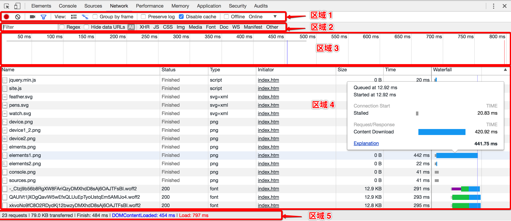
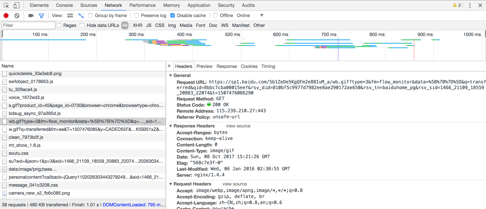

# 网络面板

##### 使用网络面板了解请求和下载的资源文件并优化网页加载性能
> 可以看到所有的资源请求，包括网络请求，图片资源，html,css，js文件等请求，可以根据需求筛选请求项，一般多用于网络请求的查看和分析，分析后端接口是否正确传输，获取的数据是否准确，请求头，请求参数的查看。

## HOW TO USE？
  
#### 区域①：Controls工具栏
用来控制Network的功能及外观,从左往右功能依次为：
- (红色圆点)Record Network Log: 红色表示此时正在记录资源请求信息；
- (灰色🚫)Clear: 清空所有的资源请求信息；
- (摄像标志)捕获快照：选中某一个快照，在概览/请求列表出现的黄色竖线，就是该快照被捕捉的真实时间，双击快照可以放大。
- (过滤标志)Filter: 过滤资源请求信息，选择后，会出现区域2所显示的过滤条件；
- Perserve Log: 勾选后，再次记录请求的信息时不擦除之前的资源信息；
- Disable cache: 勾选后，不允许缓存，所有资源均重新加载
- offline: 勾选后，模拟断开网络
- Online: 选择模拟网络状态

#### 区域②：Filters筛选栏
根据筛选条件筛选请求列表，按住command/ctrl键可多选;筛选框可以实现很多定制化的筛选，比如字符串匹配，关键词筛选等，其中关键词筛选主要有如下几种：
- domain：筛选出指定域名的请求，不仅支持自动补全，还支持*匹配。
- has-response-header：筛选出包含指定响应头的请求。
- is：通过is:running找出WebSocket请求。
- larger-than：筛选出请求大于指定字节大小的请求，其中1000表示1k。
- method：筛选出指定HTTP方法的请求，比如GET请求、POST请求等。
- mime-type：筛选出指定文件类型的请求。
- mixed-content：筛选出混合内容的请求（不懂啥意思）。
- scheme：筛选出指定协议的请求，比如scheme:http、scheme:https。
- set-cookie-domain：筛选出指定cookie域名属性的包含Set-Cookie的请求。
- set-cookie-name：筛选出指定cookie名称属性的包含Set-Cookie的请求。
- set-cookie-value：筛选出指定cookie值属性的包含Set-Cookie的请求。
- status-code：筛选出指定HTTP状态码的请求。

#### 区域③：Overviews 概览
资源被加载过来的时间线
- 如果多条时间线垂直堆叠，表示多个资源被并行加载。

#### 区域④：Request Table 请求列表
- 该视窗列出了所有的资源请求，默认按时间顺序排序，点击某个资源，可以查看更详细的信息。
- Name: 资源名称以及URL路径；
- Status: HTTP状态码；
- Type: 请求资源的MIME类型；
- Initiator解释请求是怎么发起的，有四种可能的值：
    - Parser：请求是由页面的HTML解析时发送的;
    - Redirect：请求是由页面重定向发送的;
    - Script：请求是由script脚本处理发送的;
    - Other：请求是由其他过程发送的，比如页面里的link链接点击。
- Size: Size是响应头部和响应体结合起来的大小；
- Time: Time是从请求开始到接收到最后一个字节的总时长,可利用区域3进行过滤；
- Waterfall: 显示网络请求的可视化瀑布流，鼠标悬停在某一个时间线上，可以显示整个请求各部分花费的时间
- 右键配置可请求列表
- 按时shift键，鼠标hover在请求上，可以查看请求的上游和下游，例如hover在common.js上，可以看到有一个绿色请求、一个红色请求。其中绿色请求表示common.js的上游请求，即谁触发了common.js请求，红色请求表示common.js的下游请求，即common.js又触发了什么请求。

#### 区域⑤：Summary 总览
汇总了请求数量，传输数据大小，加载时间等信息,从左往右依次显示为：
- X requests:请求总个数
- X transferred:所有请求的大小
- Finish:加载完毕时间
- DOMContentLoaded:页面文档完全加载并解析完毕之后，会触发DOMContentLoaded事件，它在两个地方都有体现：概览视窗的蓝色竖线，总览视窗的触发时间。
- Load:当所有资源加载完成后触发的，它在三个地方有体现：概览视窗的红色竖线，请求列表视窗的红色竖线，总览视窗的触发时间。

  
点击左侧某一个具体请求URL，可以看到该请求的详细HTTP请求情况：
- Headers：请求头信息和响应头信息
- Preview：预览结果，如果是文件可以查看这个文件；如果是图片可以预览这个图片；如果是从服务器返回来的JSON数据，可以查看格式话后的JSON
- Response：从服务器返回的响应结果
- Cookies：请求和响应的Cookie
    - Name：cookie的名称。
    - Value：cookie的值。
    - Domain：cookie所属域名。
    - Path：cookie所属URL。
    - Expire/Max-Age：cookie的存活时间。
    - Size：cookie的字节大小。
    - HTTP：表示cookie只能被浏览器设置，而且JS不能修改。
    - Secure：表示cookie只能在安全连接上传输。
- Timing：查看资源请求的生命周期，包含Queing/Stalled/Request/Response/Request sent/Waiting/Content Download各个阶段

