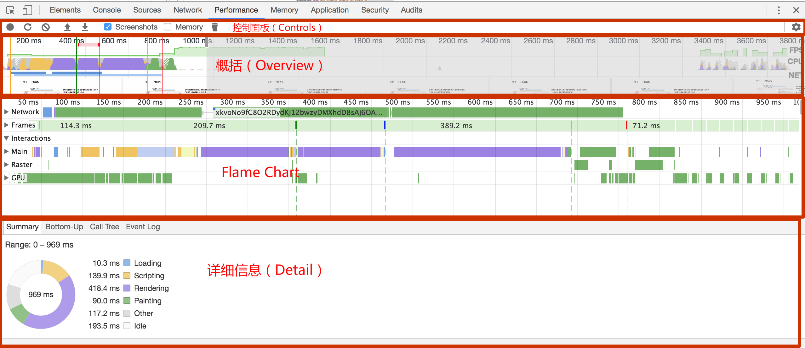

# 性能面板

**使用性能面板可以通过记录和查看网站生命周期内发生的各种事件来提高页面的运行时性能**
> 在 Chrome 57 之后时间线(Timeline)面板更名为性能(Performance)面板。

## HOW TO USE？
  
使用 Chrome DevTools 的 Performance 面板记录程序运行时的所有行为，并用于加以分析是解决程序性能问题的最好方案。 由以下四个子面板构成：
- 控制面板（Controls）: 开启记录，停止记录，配置记录期间需要记录的内容。
- 概括（Overview）: 对页面表现（行为）的一个概述。
    - 概括区域由三个图形记录组成:
        - FPS（Frames Per Second）:绿色的柱越高， FPS 值也越高。FPS 图表上方的红色小块指明了长帧(long frame)，这些可能是卡顿
        - CPU(CPU Resources):这个面积图(area chart)表明了哪种事件在消耗 CPU 资源。
        - NET:每种不同颜色的条代表一种资源。
            - 条越长表明获取该资源所花的时间越长。
            - 每个条中的浅色部分代表等待时间（资源请求被发送到收到第一个响应字节的时间），深色部分代表文件传输时间（从收到第一个字节到这个资源完全被下载好）
            - 蓝色 代表 HTML 文件，黄色 代表 Script 文件，紫色 代表 Stylesheets 文件， 绿色 代表 Media 文件，灰色 代表其他资源。
- 火焰图（Flame Chart）: 可视化 CPU 堆栈(stack)信息记录。
    - 从不同的角度分析框选区域 。例如：Network，Frames, Interactions, Main等
    - 在 Flame Chart 面板上你可能看到三根垂直的线，蓝线代表 DOMContentLoaded 事件，绿线代表渲染开始的时间( time to first paint)，红线代表 load 事件。
- 详细信息（Detail）: 当有具体事件被选择时，该面板展示这个事件的更多详细信息。如果没有事件被选择，该面板展示当前所选时间段的一些信息。
    - 精确到毫秒级的分析，以及按调用层级，事件分类的整理
        - Summary面板:从宏观层面概括了浏览器加载的总时间
            - 颜色：蓝色	；英文： Loading；含义：加载
            - 颜色：黄色	；英文： Scripting；含义：	脚本
            - 颜色：紫色	；英文： Rendering；含义：	渲染
            - 颜色：绿色	；英文： Painting；含义：	绘制
            - 颜色：深灰	；英文： Other；含义：	其他
            - 颜色：浅灰	；英文： Idle；含义：	空闲
        - Bottom-Up面板：The Heavy (Bottom Up) view is available in the Bottom-Up tab
            - Self Time代表函数本身执行消耗时间，Total Time则是函数本身消耗再加上在调用它的函数中消耗的总时间，Activity是浏览器活动。
            - Group面板可以很清晰明了得分析按照活动、目录、域、子域、URL和Frame进行分组的前端性能。
        - Call Tree面板：the Tree (Top Down) view is available in the Call Tree tab
            - Bottom-Up类似事件冒泡，Call Tree类似事件捕获。自上而下的Call-Tree更符合我们的人类正常思维，可以更直观地分析浏览器对页面的build精确到毫秒级的情况
        - Event Log面板 :展示所有阶段包括loading、javascripting、rendering、painting中各事件的耗时情况，并提供了filter输入框和按钮供你快速过滤。