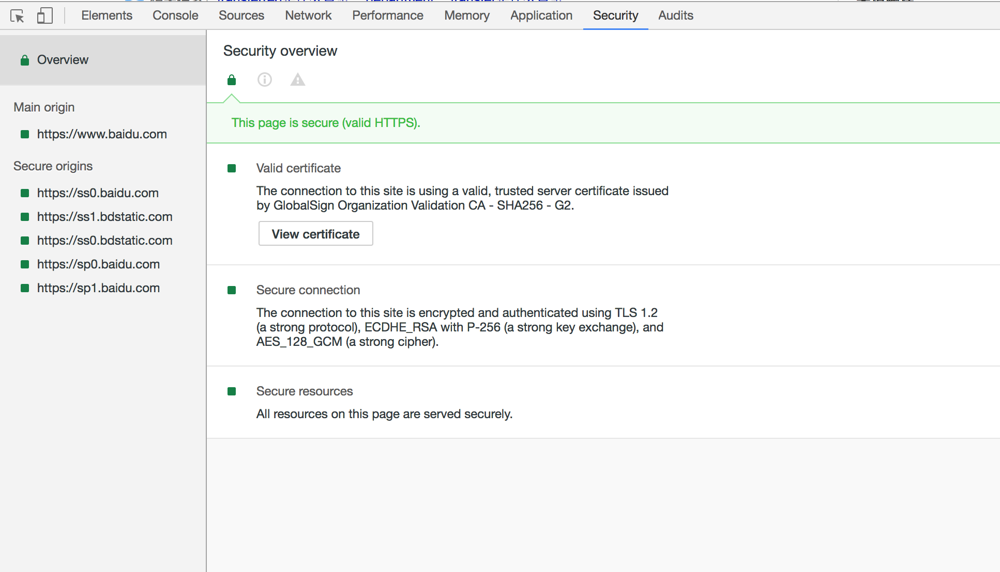

# 安全面板

**使用安全面板调试混合内容问题，证书问题等等。**
> 使用 Security Overview 可以立即查看当前页面是否安全。 检查各个源以查看连接和证书详情（安全源）或找出具体哪些请求未受保护（非安全源）。

## HOW TO USE？
  
- 如果网页是安全的，则会显示这样一条消息：This page is secure (valid HTTPS)。
    - 通过点击View certificate可以查看main origin的服务器证书信息。
    - 点击左侧可以查看指定源的连接和证书详情。
- 如果网页是不安全的，则会显示：This page is not secure。该面板可以区分两种类型的不安全的页面：
    - 如果被请求的页面通过HTTP提供服务，那么这个主源就会被标记为不安全。
    - 如果被请求的页面是通过HTTPS获取的，但这个页面接着通过HTTP继续从其他来源检索内容， 那么这个页面仍然被标记为不安全。这就是所谓的混合内容页面,混合内容页面只是部分受到保护, 因为HTTP内容(非加密的内容)可以被嗅探者入侵,容易受到中间人攻击。