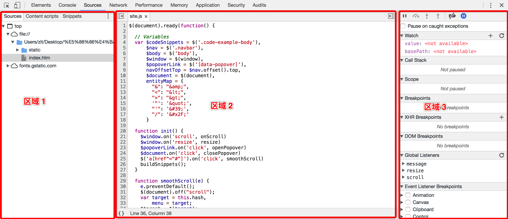

# 源代码面板

> 在源代码面板中设置断点来调试 JavaScript ，或者通过Workspaces（工作区）连接本地文件来使用开发者工具的实时编辑器。

## HOW TO USE？
  
#### 区域①：Sources Panel 的左侧分别是 Sources 和 Content scripts和Snippets
- Sources : 显示加载的JS、CSS、HTML资源列表，点击后会在区域2显示对应的源代码
    - Workspaces是Chrome DevTools的一个强大功能，这使DevTools变成了一个真正的IDE。只需打开Sources选项，然后右击左边面板的任何一个地方，选择Add Folder To Worskpace，或者只是把你的整个工程文件夹拖放入Developer Tool。
    - Workspaces会将Sources选项卡中的文件和本地项目中的文件进行匹配，所以你可以直接编辑和保存，而不必复制/粘贴外部改变的文件到编辑器。
- Content scripts : 这是 Chrome 的一种扩展程序， 它是按照扩展的ID来组织的，这些文件也是嵌入在页面中的资源，这类文件可以 读写和操作我们的资源，需要调试这些扩展文件，则可以在这个目录下打开相关 文件调试（但是我们的项目一般没有相关的扩展文件）
- Snippets : 点击创建一个新的片段文件，写完后把右键文件Run，再结合控制台查看相关信息

#### 区域②：显示源码
- 如果当前代码是经过压缩的话，可以点击左下方的花括号{}来增强可读性
- 点击JS代码块前面的数字可以设置断点，所有的断点都会列出右侧的断点区；
- 除了常规断点外, 还有个条件断点(右键 conditional breakpoint), 在设置的条件为 true 时才会断点, 在循环中需要断点时比较有用.
- 在当前的代码执行区域，在调试中如果发现需要修改的地方，可以立即修改，修改后保存即可生效

#### 区域③：调试的功能区域
- 最上面一排按钮分别是：
    - 暂停(F8快捷键):继续执行脚本的命令,如果后面还有断点,直接执行到后面的断点,没有断点直接执行到代码最后面
    - 单步执行(F10快捷键):直接执行完函数进行下一步,不进入函数
    - 单步跳入此执行块(F11快捷键):进入函数逐步执行函数
    - 单步跳出此执行块(shift + F11快捷键):跳出函数
    - 禁用所有断点:注释断点,仍旧显示但是不起作用
    - 启用所有断点:图标激活之后,在代码出错之后会直接跳转到代码出错的那一行
- Watch：可以添加需要监听的变量，执行断点时可以观察变量的变化情况；
    - 选中变量后右键add selected text to watches可以添加监听
    - Watch窗口可直接添加需要监听的变量
- Call Stack：查看断点执行的堆栈情况，可以快速定位断点执行入口；
    - 若想重新从某个调用方法处执行，可以右键Restart Frame， 断点就会跳到此处开头重新执行，Scope 中的变量值也会依据代码重新更改
- Scope : 查看此时局部变量和全局变量的值
- Breakpoints: 所有当前js的断点都会展示在这个区域，你可以点击按钮用来“去掉/加上”此处断点，也可以点击下方的代码表达式，跳到相应的程序代码处来查看
- XHR Breakpoints: 点击右侧的+号，可以添加请求的URL，一旦 XHR 调用触发时就会在 request.send() 的地方中断
- DOM Breakpoints: 监听和查看某个元素的变化的DOM断点列表
- Event Listener Breakpoints：勾选你要监听的事件，在指定的事件执行时，断点就会有触发；
